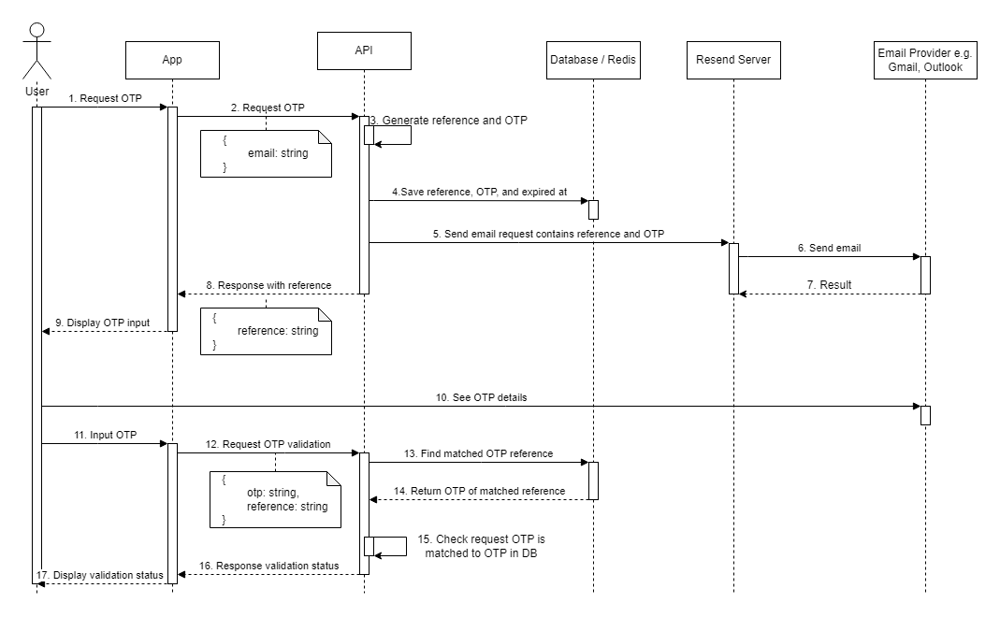

# OTP demo

For learning how OTP flow should be

## Tech stack

- [Bun](https://bun.sh/)
- [Elysia](https://elysiajs.com/)
- [Resend](https://resend.com/home)
- [Redis](https://redis.io/)

## Flow



## Set up

1. Install [Redis](https://redis.io/docs/latest/operate/oss_and_stack/install/install-redis/)

2. Install packages

```
bun i
```

3. Config valid domain in `Resend`

4. Duplicate `.env.example` to `.env.local` and fill in env values

## Development

1. Start redis server (On Windows WSL)

```
sudo service redis-server start
```

2. Start elysia server

```
bun run dev
```

3. Open localhost

```
http://localhost:<YOUR_PORT>/
```
